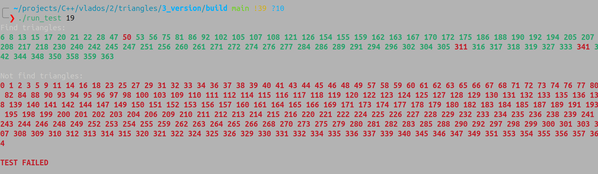

# HW3D 

# По поводу Windows и MSVC


# Зависимости:
У проекта **НЕТ обязательных зависимостей** для его штатной работы. Зависимости есть для unit-тестирования и некоторых дебажных функций, об этом читайте далее.\
Однако для удобной работы понадобятся следующие инструменты:

## Для комплиляции:
[clang++](https://clang.org/)\
[g++](https://gcc.gnu.org/)\
`clang` рекомендуется для данного проекта, так как на момент написания проекта он лучше умеет работать с `.cppm` модулями.


## Для сборки:
[cmake](https://cmake.org/ "ссылка на официальный сайт cmake")\
[ninja](https://ninja-build.org "ссылка на оффициальный сайт ninja")\
`Ninja` рекомендуется для данного проекта, так как в большистве пакетных менеджеров поставляется версия, для которой `cmake` умеет работать с модулями (`.cppm`).

## Требования:
`clang++` - **18.0+**\
`g++`     - **15.0+**\
`cmake`   - **3.28+**\
`ninja`   - **1.11.1+**\
<br>

*в `start.sh` будет явно указываться clang++ как комплилятор, потому что clang меньше всего подвержен багам с модулями, как показал мой личный опыт*

## Для unit-тестирования (проверка существования в `cmake`):
[googletest](https://github.com/google/googletest "ссылка на официльный репозиторий googletest")

## Для скачивания проекта:
[git](https://git-scm.com/ "ссылка на официальный сайт git")

## Для графического дампа (дебажная функция, но доступна в релизной версии при соотвествующем флаге):
[opengl](https://www.opengl.org/ "сслыка на официальный сайт opengl")

# Установка:
```bash
git clone --recurse-submodules https://github.com/Maksim-Sebelev/Triangles.git
cd Triangles
```

# Сборка проекта:

**СПЕЦИАЛЬНО ДЛЯ КОНСТАНТИНА ИГОРЕВИЧА:**
```bash
bash KV.sh && cd build
```

**Не спешите собирать проект руками, в проекта есть удобный shell-скрипт для этого**\
Для генерации системы сборки выполните:
```bash
cmake -S Src -B build -DCMAKE_BUILD_TYPE=Release -DCMAKE_EXPORT_COMPILE_COMMANNDS=1
```
Так же можете явно указать систему сборки (рекомендуется `Ninja`):
```bash
cmake -S Src -B build -G Ninja -DCMAKE_BUILD_TYPE=Release -DCMAKE_EXPORT_COMPILE_COMMANNDS=1
```
*после -G можете указать свою любимую систему сборки, но не факт что для нее cmake поддерживает работу с модулями.*

Для компиляции:
```bash
cmake --build build
```

После чего перейдите в папку `build`:
```bash
cd build
```

## Опции Cmake:
Предоставляются так же несколько дополнительных опций для сборки проекта:\
`USE_LOGGER`\
`TREE_GRAPHIC_DUMP`\
`VERBOSE_OUTPUT`

Чтобы включить эти опции добавьте в вызов cmake следующее:
```bash
-DUSE_LOGGER=1
```
```bash
-DTREE_GRAPHIC_DUMP=1
```
```bash
-DVERBOSE_OUTPUT=1
```

Пример использования с вызовом `cmake`:
```bash
cmake -S Src -B build -DCMAKE_BUILD_TYPE=Release -DCMAKE_EXPORT_COMPILE_COMMANNDS=1 -DUSE_LOGGER=1 -DTREE_GRAPHIC_DUMP=1 -DVERBOSE_OUTPUT=1
```


## Об опциях cmake:
`USE_LOGGER` - включает логгер (`Src/third-party/logger`) в проект и определяет макрос `USE_LOGGER` для всех файлов проекта. После этого можно использовать логгер в любом файле проекта. *Подробнее про логгер можно прочитать в его официльном [репозитории](https://github.com/Maksim-Sebelev/logger.git) или в `README.md` по относительному пути `./Src/third-party/logger/README.md`*

<br>


- *пример логфайла*

<br>

`TREE_GRAPHIC_DUMP` - включает в проект функцию графиечского дампа октодерева в формате `opengl` и определяет макрос `TREE_GRAPHIC_DUMP`. Функция доступна как метод класса октодерева. Подробнее про графический дамп будет написано далее.

<br>

`VERBOSE_OUTPUT` - дебажная опция, включает подробный вывод информации в тестах, а так же цветной вывод в консоль.

# Если Ваше устройство поддерживает `bash` или `zsh`
*Наверняка, если у Вас Linux - то у вас поддерживается `bash`*

# Сборка проекта:
В таком случае можете просто выполнить:
```bash
bash start.sh
```
или для `zsh`:
```bash
zsh start.sh
```

Так же для включения опций `cmake` описанных ранее передайте `start.sh` аргументы:
```bash
use-logger   # для подключения логгера -DUSE_LOGGER=1
verbose      # для включение подробного вывода -DTREE_GRAPHIC_DUMP=1
graphic-dump # для подключения функции графиечского дампа дерева -DVERBOSE_OUTPUT=1
```
Пример использования:
```bash
bash start.sh use-logger verbose graphic-dump
```
- сгенерирует систему сборки и соберет проект со всеми предложенными опциями

Скрипт выведет информацию, если что-то пойдет не так.

После перейдите в папку `build`:
```bash
cd build/
```
и теперь можете начинать работать с проектом.

<br>

Так же предоставлен скрипт `debug_start.sh`, который подключит все возможные опции для дебага и соберер проект вместе с ними.

# Если вы категорически НЕ согласны со стилем оформлением кода автора:
Предоставлен скрипт `format.sh` который вызывает `clang-format` для всех необходимых файлов проекта. Подключайте свой любимый конфиг или оставьте настройки по умолчанию и **наслаждайтесь** табами в 2 пробела и { без переноса на следующую строку (без негатива):
```bash
bash format.sh
```
или:
```bash
zsh format.sh
```

<br>

# Структура проекта:
```txt
.
├── assets
│   ├── bug-on-clang.png
│   ├── bug-on-gcc.png
│   └── no-msvc.PNG
├── KV.sh
├── start.sh
├── debug_start.sh
├── format.sh
├── README.md
├── Src
│   ├── CMakeLists.txt
│   ├── include
│   │   ├── create_run_program_file
│   │   │   └── cringe
│   │   │       └── create_run_program_file.hpp
│   │   └── global
│   │       ├── custom_console_output.hpp
│   │       └── global.hpp
│   ├── modules
│   │   ├── geometry
│   │   │   ├── base_geometry_obj
│   │   │   │   ├── line.cppm
│   │   │   │   ├── plain.cppm
│   │   │   │   └── point.cppm
│   │   │   ├── global
│   │   │   │   ├── constants.cppm
│   │   │   │   └── relative_positions.cppm
│   │   │   ├── tree
│   │   │   │   └── octree.cppm
│   │   │   └── triangle
│   │   │       └── triangle.cppm
│   │   ├── math
│   │   │   ├── compare
│   │   │   │   └── compare.cppm
│   │   │   └── linear_algebra
│   │   │       ├── linear_systems.cppm
│   │   │       ├── matrix.cppm
│   │   │       └── vector.cppm
│   │   └── test
│   │       ├── execute_test
│   │       │   └── execute_test.cppm
│   │       ├── flag_parse
│   │       │   ├── flag_parser.cppm
│   │       │   └── input_stream.cppm
│   │       ├── global
│   │       │   └── test_files.cppm
│   │       ├── parse_result
│   │       │   └── parse_test_result.cppm
│   │       └── read_input
│   │           ├── get_test_data.cppm
│   │           ├── read_test_answer.cppm
│   │           └── read_test_data.cppm
│   ├── src
│   │   ├── run_double_triangles.cpp
│   │   └── run_float_triangles.cpp
│   └── third-party
│       └── logger
│           ├── README.md
│           ├── Src
│           │   ├── CMakeLists.txt
│           │   ├── include
│           │   │   ├── global
│           │   │   │   ├── custom_console_output.hpp
│           │   │   │   └── global.hpp
│           │   │   └── logger
│           │   │       └── log_background_settings.hpp
│           │   └── modules
│           │       └── log.cppm
│           ├── start.sh
│           └── tests
│               └── test.cpp
└── tests
    ├── e2e
    │   ├── ans
    │   │   ├── 1.ans
    │   │   ├── ...
    │   │   └── 20.ans
    │   └── dat
    │       ├── 1.dat
    │       ├── ...
    │       └── 20.dat
    └── unit-tests
        ├── geometry
        │   ├── unit_test_line.cpp
        │   ├── unit_test_octree.cpp
        │   ├── unit_test_plain.cpp
        │   ├── unit_test_point.cpp
        │   └── unit_test_triangles.cpp
        ├── math
        │   ├── unit_test_compare.cpp
        │   ├── unit_test_linear_system.cpp
        │   ├── unit_test_matrix.cpp
        │   └── unit_test_vector.cpp
        └── test
            ├── unit_test_flag_parser.cpp
            ├── unit_test_get_test_data.cpp
            ├── unit_test_read_answer.cpp
            └── unit_test_read_test_data.cpp

39 directories, 93 files
```

# Что из себя представляет проект?
## Цель проекта:
Проект реализован под вполне конкретную задачу:\
На вход подается число `N`, после чего идет описание `N` треугольников в 3-мерном евклидовом пространстве. А на выходе ожидаются номера тех треугольников, которые пересекаются с камим-либо другим из данного списка.

## Формат входных данных:
Опишем более подробно, как задается треугольник:
```txt
<первая вершина> <вторая вершина> <третья вершина>
```
Хорошо, а как задается вершина? - как точка в 3-мерном евклидовом пространстве:
```txt
<x координата> <y координата> <z координата>
```
Сами координаты имеют НЕ целочисленный тип. В программе используется `float`, но благодаря
```cpp
using coordinate_t = float;
```
Легко все переделать на `double`, если Вы хотите **пожертвовать** скоростью ради точности.

Подведем итог: пусть мы хотим считать треугольник `ABC` со следующих данных:
```bash
1.0 2.0 3.0 4.0 5.0 6.0 7.0 8.0 9.0
```
Тогда:\
вершина `A` будет иметь координаты `(1.0, 2.0, 3.0)`\
вершина `B` будет иметь координаты `(4.0, 5.0, 6.0)`\
вершина `C` будет иметь координаты `(7.0, 8.0, 9.0)`

Теперь мы готовы осознать общий формат ввода:
```bash
3 # количество треугольников => ожидается 9*3=27 чисел на вводе
1.0  2.0  3.0 # первая вершина первого  треугольника
4.0  5.0  6.0 # вторая вершина первого  треугольника
7.0  8.0  9.0 # третья вершина первого  треугольника
10.0 11.0 12.0 # первая вершина второго  треугольника
13.0 14.0 15.0 # вторая вершина второго  треугольника
16.0 17.0 18.0 # третья вершина второго  треугольника
19.0 20.0 21.0 # первая вершина третьего треугольника
22.0 23.0 24.0 # вторая вершина третьего треугольника
25.0 26.0 27.0 # третья вершина третьего треугольника
```
*числа подобны для просты понимания. вполне могут быть другие числа, и не обязтаельно .0*

## Формат выходных данных:
Программа возвращает номера тех треугольников, которые имеют пересечесение хотя-бы с одним треугольником из того же списка (*пересечения с самим собой, очевидно, не учитываются*). Причем номера идут в **отсортированном по возрастанию порядке**.


## Форматы ввода-вывода:
Программа имеет опцию `--input_sream` и ее короткую версию `-i`, которая имеет 2 значения: `stdin` и `files`, где `stdin` является значением по умолчанию. Это значит, что без явного указания программа ожидает данные с `stdin`.\
Разберем на примерах (команды выполняются из папки `build/`):
```bash
./run_triangles                      # ожидает данные с stdin, и выведет результат в stdout
./run_triangles --input_stream=stdin # ожидает данные с stdin, и выведет результат в stdout
./run_triangles -istdin              # ожидает данные с stdin, и выведет результат в stdout
```
Если же вы укажете значение `files`, то в качестве аргументов должны передать пути до файлов, откуда будут браться данные.\
**ВАЖНО**:
1) Данная опция предусматривалась исключительно для тестирования программы.
2) В силу `1)`, программа ожидает так же получить файл с правильным ответом. Будут сравниваться полученные в результате работы программы данные и данные из файла с ответом. Если они равные, программа сделать `return 0`, иначе `return 1` и выведет соотвественную информацию о результате тестирования.
3) Тестовые данные подаются только в `.dat` файлах. Иные расширения приниматься не будут.
4) Ответы подаются только в `.ans` файлах.
5) Нельзя определять файлы до явно указания `--input_stream=stdin`

Так же на формат вывода влияется опция `--verbose` или ее короткая версия `-v`. Она Делает вывод о результах тестирования более подробным (с указанием правильно и неправильно определенных треугольников). Нужно только для более приятного дебага, но так же может раскрасить обычный серый вывод в обычном режиме работы.

<br>


- *пример вывода при `--verbose`*


<br>

Разбереме на примерах (команды выполняются из папки `build/`):
```bash
./run_triangles --input_stream=files test.dat test.ans # тестовые данные из test.dat, ответ из test.ans, на выход подается инфофрмация о результатах тестирования
./run_triangles -ifiles              test.dat test.ans # тестовые данные из test.dat, ответ из test.ans, на выход подается инфофрмация о результатах тестирования
```

```bash
./run_triangles --verbose--input_stream=files test.dat test.ans # тестовые данные из test.dat, ответ из test.ans, на выход подается ПОДРОБНАЯ инфофрмация о результатах тестирования
./run_triangles -v -ifiles test.dat test.ans # тестовые данные из test.dat, ответ из test.ans, на выход подается ПОДРОБНАЯ инфофрмация о результатах тестирования
./run_triangles -v # входные данные из stdin, в stdout - цветной вывод обычного результата программы
```

# Тестирование программы:
В директории `./tests` есть 2 поддиректории: `e2e` и `unit-tests`:
```bash
tests
    ├── e2e
    │   ├── ans
    │   │   ├── 1.ans
    │   │   ├── ...
    │   │   └── 20.ans
    │   └── dat
    │       ├── 1.dat
    │       ├── ...
    │       └── 20.dat
    └── unit-tests
        ├── geometry
        │   ├── unit_test_line.cpp
        │   ├── unit_test_octree.cpp
        │   ├── unit_test_plain.cpp
        │   ├── unit_test_point.cpp
        │   └── unit_test_triangles.cpp
        ├── math
        │   ├── unit_test_compare.cpp
        │   ├── unit_test_linear_system.cpp
        │   ├── unit_test_matrix.cpp
        │   └── unit_test_vector.cpp
        └── test
            ├── unit_test_flag_parser.cpp
            ├── unit_test_get_test_data.cpp
            ├── unit_test_read_answer.cpp
            └── unit_test_read_test_data.cpp
```

Для unit-тестирования используется `googletest` (cmake не выполнит сборку проекта, если он не установлен `cmake`).\
Все модули программы проходят unit-тестирования. Вот так выглядит папка для тестирования:
```bash
unit-tests
    ├── geometry
    │   ├── unit_test_line.cpp
    │   ├── unit_test_octree.cpp
    │   ├── unit_test_plain.cpp
    │   ├── unit_test_point.cpp
    │   └── unit_test_triangles.cpp
    ├── math
    │   ├── unit_test_compare.cpp
    │   ├── unit_test_linear_system.cpp
    │   ├── unit_test_matrix.cpp
    │   └── unit_test_vector.cpp
    └── test
        ├── unit_test_flag_parser.cpp
        ├── unit_test_get_test_data.cpp
        ├── unit_test_read_answer.cpp
        └── unit_test_read_test_data.cpp
```

Так же есть e2e (end to end) тесты. Для этого в папках `./tests/e2e/dat/` и `./tests/e2e/ans/` хранятся файлы с тестовыми данными и правильными ответами соотвественно.

Для компиляции тестов выполните:
```bash
ninja build_tests # сборка unit-тестов, e2e собираются вместе со всем проектом вместе
```
После чего запустите тесты:
```bash
ctest
```
Или для подробного вывода:
```bash
ctest --verbose
```
Так же для более удобной и быстрой работы с определенными e2e тестами автоматически генерируется (с правом на исполнение) файл `build/run_test`:
```bash
#!/bin/bash

# DO NOT TRY TO EDIT THIS FILE.
# ALL YOUR CORRECTIONS WILL BE LOST.

# Automatic generated with:
# '/home/ananasik/projects/C++/vlados/2/triangles/3_version/start.sh'
# at:
# Sat Oct 25 11:49:38 AM MSK 2025

set -euo pipefail

if [ $# -ne 1 ]; then
    echo "expect only 1 arg: number of test."
    exit 1
fi

n="$1"
./run_triangles -v -ifiles ../tests/e2e/dat/"$n".dat ../tests/e2e/ans/"$n".ans
```
- Здесь показан пример сгенерированного файла, строчки с путем до файла и временем генерации у вас конечно будут другие.

Скрипт позволяет быстро запускать определенный e2e-тест с подробным выводом (опция `-v`), например:
```bash
./run_test 1
./run_test 29
```
Вызовет тест с номером 1, а потом с номером 29. Для дебага очень удобная вещь, потому что запускать все тесты `ctest` разом не самая удобная вещь для выявления мелких недочетов.

<br>

# Опции программы:
После компиляции проекта будут созданы файлы `build/run_triangles` и `build/run_double_triangles`. Это 1 и та же программа, которая в первом случае оперирует `float` числами, а во втором `long double`.\
Программа имеет несколько опций:
`--verbose -v`\
`--input_stream -i`\
`--bad_triangles -b`\
Про первые 2 уже было рассказано, они по большей части нужны для дебага. Разберем `--bad_triangles`:\
По условию задачи на вход подаются треугольники. Треугольник по определению это фигура, которая имеет 3 неколинеарные вершины, каждые 2 из которых попарно не совпадают. Однако наш любимый пользователь не может в общем случае это гарантировать. Поэтому для этого предусмотрена отдельная проверка при пересечении треугольников. Однако эта проверка очень обширная: треугольник может быть точкой, отрезком или обычным валидным треугольником. При песеченении, валидным является лишь 1 случай из 9 - когда оба треугольника валидны. Поэтому эта проверка опциональная. Если Вы уверены в коррекности ваших данных, то ничего не вызывайте, иначе примените опцию `--bad_triangles` или ее короткую версию `-b` для корректной обработки результата.

# Алгоритм работы:
Главный класс, реализованный в проекте:
```cpp
template <typename coordinate_t> class triangle_t;
```
имеет метод:
```cpp
bool is_intersect_with_another_triangle(const triangle_t& trianglebool, bool parse_degenerate_triangles = false) const;
```
*(его асимтотическая сложность `O(1)`)*\
думаю смысл его понятен.

Сам же принцип работы метода довольно прост:
Если треугольники лежат в разных плоскостях, то рассматривается линия пересеченяия эти плоскостей. Она пересекается с каждым треугольником (это пересечение либо пустое множество, либо точка, либо отрезок). И далее проверяется пересекаются ли эти самые отрезки пересечения между собой. Если да - то треугольники пересекаются, в противном случае - нет.
Если же треугольники лежат в одной плоскости, то ищутся попарные пересечения между сторонами треугольников. Если хотя бы 1 пара пересекается, то и треугольники тоже, иначе - нет.

Так же реализован класс:
```cpp
template <typename coordinate_t> class octree_t;
```
И в нем метод:
```cpp
void find_intersections();
```

Класс `octree_t` строит внутри себя окто-дерево. При достаточно мелком разбиении внутри каждого октанта все треугольники попарно проверяются на перечении. Обычное дерево, только по пространству, не знаю что тут еще написать. Могу дать [ссылочку](https://ru.wikipedia.org/wiki/%D0%9E%D0%BA%D1%82%D0%BE%D0%B4%D0%B5%D1%80%D0%B5%D0%B2%D0%BE) на статью на Википедии про окто-дерево. Асимптотическая сложность программы выходит **O(N*log(N))**.
<br>

# Графический дамп окто-дерева в opengl

# ПОКА ОТСУТСТВУЕТ
Для того, чтобы он был доступен нужно собрать проект с опцией `cmake` `-DTREE_GRAPHIC_DUMP` (об этом немного говорилось в начале :) ). При такой сборке в классе окто-дерева появляется метод:
```cpp
void graphic_dump() const;
```
Который создает файл в формате `opengl` с дампом самого дерева и всех треугольников.

# Проблемы проекта:
1) Никакая работа с погрешностями вычисления floating-point чисел. Везде допустимая погрешность взята случайно, как просто достаточно маленькое число (`1e-6` - `1e-2`), из-за чего могут быть возникать проблемы с ложными пересечениями. Это **сильно** сказывается на точности если вершины треугольников сильно удалены от 0.
2) Я не смог в `ExternalProject_Add` для логгера. Подробнее: логгер для данного проекта - это внешний проект, который уже оттестирован и подтвердил свою надежность временем. Поэтому к проекту его добавлять хочется в релизной версии, но функция `cmake` `add_subdirectory` так не умеет и берет для подроекта переменные основного `cmake`. Для решения этой проблемы, как я понимаю, и нужен `ExternalProject_Add`. Но я в него не смог (да, даже с нейросетями). Поэтому логгер подключается через костыль:
```cmake
if (USE_LOGGER)
    message("-- Adding logger")

    # костыль, но так надо чтобы не ждать логгера по полгода и без запары с exterbal project (я 2 раза пытался его настроить, оба раза проиграл)
    set(MAIN_PROJECT_BUILD_TYPE ${CMAKE_BUILD_TYPE})
    set(CMAKE_BUILD_TYPE Release)

    set(LOGGER_PROJECT_DIR ${CMAKE_SOURCE_DIR}/third-party/logger/Src)
    add_subdirectory(${LOGGER_PROJECT_DIR})

    function(add_logger some_target)
        target_link_libraries(${some_target} 
            PRIVATE
                logger
        )
        target_compile_definitions(${some_target}
            PRIVATE
                USE_LOGGER
        )
    endfunction(add_logger)

    set(TARGETS_USING_LOGGER
        ${TRIANGLES_EXE}
        ${DOUBLE_TRIANGLES_EXE}
        ${HELP_GEOMETRY_LIB}
        ${TRIANGLES_LIB}
        ${OCTREE_LIB}
        ${TEST_LIB}
        ${MATH_LIB}
        ${ALL_UNIT_TESTS_TARGET}
    )

    foreach(target_that_use_logger ${TARGETS_USING_LOGGER})
        add_logger(${target_that_use_logger})
    endforeach()

    set(CMAKE_BUILD_TYPE ${MAIN_PROJECT_BUILD_TYPE})

endif()
```
<br>
<br>

# Рофлы:

Я словил баги сразу на 2 компиляторах:

<br>


<br>


- *Приношу извинения за качество*
