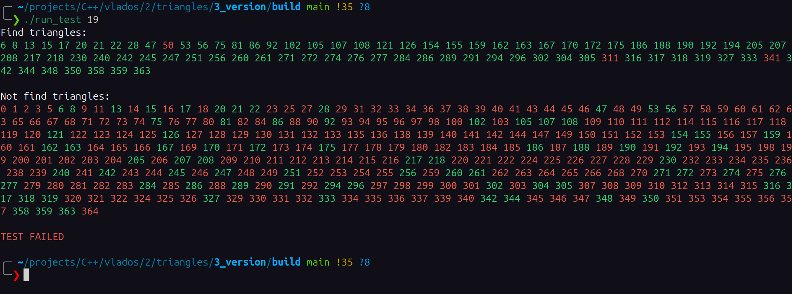

# HW3D 

# По поводу Windows и MSVC


# Зависимости:
У проекта **НЕТ обязательных зависимостей** для его штатной работы. Зависимости есть для unit-тестирования и некоторых дебажных функций, об этом читайте далее.\
Однако для удобной работы понадобятся следующие инструменты:

## Для комплиляции:
[clang++](https://clang.org/)\
[g++](https://gcc.gnu.org/)\
`clang` рекомендуется для данного проекта, так как на момент написания проекта он лучше умеет работать с `.cppm` модулями.

## Для сборки:
[cmake](https://cmake.org/ "ссылка на официальный сайт cmake")\
[ninja](https://ninja-build.org "ссылка на оффициальный сайт ninja")\
`Ninja` рекомендуется для данного проекта, так как в большистве пакетных менеджеров поставляется версия, для которой `cmake` умеет работать с модулями (`.cppm`).

Вот что про это говорит сам `cmake`:
```bash
Modules are supported only by Ninja, Ninja Multi-Config, and Visual Studio
generators for VS 17.4 and newer.  See the cmake-cxxmodules(7) manual for
details.  Use the CMAKE_CXX_SCAN_FOR_MODULES variable to enable or disable
scanning.
```

## Для графики:
[opengl](https://www.opengl.org/ "ссылка на официальный сайт opengl") - для 3D дампа дерева.

## Для скачивания проекта:
[git](https://git-scm.com/ "ссылка на официальный сайт git")

## Требования:
`clang++` - **18.0+**\
`g++`     - **15.0+**\
`cmake`   - **3.28+**\
`ninja`   - **1.11.1+**\
<br>

*в `start.sh` будет явно указываться clang++ как комплилятор, потому что clang меньше всего подвержен багам с модулями, как показал мой личный опыт*

# Установка:
```bash
git clone --recurse-submodules https://github.com/Maksim-Sebelev/Triangles.git
cd Triangles
```

# Сборка проекта:

**СПЕЦИАЛЬНО ДЛЯ КОНСТАНТИНА ИГОРЕВИЧА:**
```bashgrap
bash KV.sh && cd build
```

**Не спешите собирать проект руками, в проекте есть удобный shell-скрипт для этого**\
Для генерации системы сборки выполните:
```bash
cmake -S Src -B build -DCMAKE_BUILD_TYPE=Release -DCMAKE_EXPORT_COMPILE_COMMANNDS=1
```
- Вероятно на Linux cmake постарается сгенерировать систему сборки на make, что на момент 28 октября 2025 года приведет к ошибке, потому что cmake не поддерживает .cppm модули для make, поэтому:

Так же можете явно указать систему сборки (рекомендуется `Ninja`):
```bash
cmake -S Src -B build -G Ninja -DCMAKE_BUILD_TYPE=Release -DCMAKE_EXPORT_COMPILE_COMMANNDS=1
```
*после -G можете указать свою любимую систему сборки, но не факт что для нее cmake поддерживает работу с модулями.*

Для компиляции:
```bash
cmake --build build
```

После чего перейдите в папку `build`:
```bash
cd build
```

## Опции Cmake (здесь описаны опции, предоставляемые для пользователей. Есть еще несколько дебажных опций, описанных далее):
Предоставляются опция для сборки проекта:\
`TREE_3D_DUMP`

Чтобы включить эту опцию добавьте в вызов cmake следующее:
```bash
-DTREE_3D_DUMP=1
```

Пример использования с вызовом `cmake`:
```bash
cmake -S Src -B build -DCMAKE_BUILD_TYPE=Release -DCMAKE_EXPORT_COMPILE_COMMANNDS=1 -DTREE_3D_DUMP=1
```

`TREE_3D_DUMP` - включает в проект функцию графиечского дампа октодерева в формате `opengl` и определяет макрос `TREE_GRAPHIC_DUMP`. Функция доступна как метод класса октодерева. Подробнее про графический дамп будет написано далее.

# Если Ваше устройство поддерживает `bash` или `zsh`
*Наверняка, если у Вас Linux   - то у вас поддерживается `bash`*\
*Наверняка, если у Вас macOS   - то у вас поддерживается `zsh`*\
*Наверняка, если у вас Windows - то вы не читаете это.*

# Сборка проекта:
В таком случае можете просто выполнить:
```bash
bash start.sh
```
или для `zsh`:
```bash
zsh start.sh
```

Так же для включения опции `cmake` описанной ранее передайте `start.sh` аргумент:
```bash
3d-dump # для подключения функции графического 3D дампа дерева -DTREE_3D_DUMP
```
Пример использования:
```bash
bash start.sh 3d-dump 
```
- сгенерирует систему сборки и соберет проект c опциями `-DTREE_3D_DUMP`

Скрипт выведет информацию, если что-то пойдет не так.

После перейдите в папку `build`:
```bash
cd build/
```
и теперь можете начинать работать с проектом.

<br>

# Если вы категорически НЕ согласны со стилем оформлением кода автора:
Предоставлен скрипт `format.sh` который вызывает `clang-format` для всех необходимых (`.cpp`, `.cppm`, `.hpp`) файлов проекта. Подключайте свой любимый конфиг или оставьте настройки по умолчанию и **наслаждайтесь** табами в 2 пробела и { без переноса на следующую строку (без негатива):
```bash
bash format.sh
```
или:
```bash
zsh format.sh
```

<br>

# Опции программы:
После компиляции проекта будут созданы файлы `build/run_triangles` и `build/run_double_triangles`. Это 1 и та же программа, которая в первом случае оперирует `float` числами, а во втором `long double`.

Программа имеет несколько опций (*дебажные опции не будут здесь описаны*):\
`--help -h`\
`--color -c`\
`--bad_triangles -b`

Опция `--color -c` включает цветной вывод в консоль и немного комментариев об выводе прогаммы.

Разберем `--bad_triangles -b`:\
По условию задачи на вход подаются треугольники. Треугольник по определению это фигура, которая имеет 3 неколинеарные вершины, каждые 2 из которых попарно не совпадают. Однако наш любимый пользователь не может в общем случае это гарантировать. Поэтому для этого предусмотрена отдельная проверка при пересечении треугольников. Однако эта проверка очень обширная: треугольник может быть точкой, отрезком или обычным валидным треугольником. При песеченении, валидным является лишь 1 случай из 9 - когда оба треугольника валидны. Поэтому эта проверка опциональная. Если Вы уверены в коррекности ваших данных, то ничего не вызывайте, иначе примените опцию `--bad_triangles` или ее короткую версию `-b` для корректной обработки результата.


<br>

# Графический дамп окто-дерева в opengl

# ПОКА ОТСУТСТВУЕТ
Для того, чтобы он был доступен нужно собрать проект с опцией `cmake` `-DTREE_3D_DUMP` (об этом немного говорилось в начале :) ). При такой сборке в классе окто-дерева появляется метод:
...


# Что из себя представляет проект?
## Цель проекта:
Проект реализован под вполне конкретную задачу:\
На вход подается число `N`, после чего идет описание `N` треугольников в 3-мерном евклидовом пространстве. А на выходе ожидаются номера тех треугольников, которые пересекаются с камим-либо другим из данного списка.

## Формат входных данных:
Опишем более подробно, как задается треугольник:
```txt
<первая вершина> <вторая вершина> <третья вершина>
```
Хорошо, а как задается вершина? - как точка в 3-мерном евклидовом пространстве:
```txt
<x координата> <y координата> <z координата>
```
Класс треугольника является шаблонным, и принимает тип координат вершин треугольника, который обязан быть floating-point типом:
```cpp
template <typename coordinate_t>
class triangle_t
{
    static_assert(std::is_floating_point_v<coordinate_t>,
                  "In triangle_t as template type excpect only floating point type.");
    /* ... */
};
```
Проект реализует 2 исполняемых файла:\
`run_triangles`\
`run_double_triangles`\
Первый оперирут типом `float`, второй - `long double`

Подведем итог: пусть мы хотим считать треугольник `ABC` со следующих данных:
```bash
1.0 2.0 3.0 4.0 5.0 6.0 7.0 8.0 9.0
```
Тогда:\
вершина `A` будет иметь координаты `(1.0, 2.0, 3.0)`\
вершина `B` будет иметь координаты `(4.0, 5.0, 6.0)`\
вершина `C` будет иметь координаты `(7.0, 8.0, 9.0)`

Теперь мы готовы осознать общий формат ввода:
```bash
3 # количество треугольников => ожидается 9*3=27 чисел на вводе
1.0  2.0  3.0  # первая вершина первого  треугольника
4.0  5.0  6.0  # вторая вершина первого  треугольника
7.0  8.0  9.0  # третья вершина первого  треугольника
10.0 11.0 12.0 # первая вершина второго  треугольника
13.0 14.0 15.0 # вторая вершина второго  треугольника
16.0 17.0 18.0 # третья вершина второго  треугольника
19.0 20.0 21.0 # первая вершина третьего треугольника
22.0 23.0 24.0 # вторая вершина третьего треугольника
25.0 26.0 27.0 # третья вершина третьего треугольника
```
*числа подобны для просты понимания. вполне могут быть другие числа, и не обязтаельно .0*

## Формат выходных данных:
Программа возвращает в `stdout` номера тех треугольников, которые имеют пересечесение хотя бы с одним треугольником из того же списка (*пересечения с самим собой, очевидно, не учитываются*). Причем номера идут в **отсортированном по возрастанию порядке**.

<br>
<br>
<br>

# Информация для контрибьютеров и разработчиков:

# Зависимости:

## Для e2e-тестирования:
[python3](https://python.org)

## Для unit-тестирования (проверка существования в `cmake`):
[googletest](https://github.com/google/googletest "ссылка на официльный репозиторий googletest")

## Для 2D дампа дерева (`Src/modules/geometry/tree/octree.cppm`)
[graphviz](https://graphviz.org/ "ссылка на официальный сайт graphviz") - для 2D дампа дерева.

# Сборка:
Для сборки в дебаге используйте скрипт `debug_start.sh`:
```bash
bash debug_start.sh
```
- соберет проект со всеми дебажными опциями

Для сборки в релизе используйте скрипт `start.sh`:
```bash
bash start.sh
```

Пример использования:
```bash
bash start.sh 3d-dump 
```
- сгенерирует систему сборки и соберет проект c опцией `-DTREE_3D_DUMP`


Скрипт `debug_start.sh` подключает все опции `cmake`, которые описаны далее.\
Скрипт выведет информацию, если что-то пойдет не так.

# Опции Cmake:
Предоставляются так же несколько дополнительных опций для сборки проекта:\
`TREE_2D_DUMP`\
`TREE_3D_DUMP`\
`USE_LOGGER`

Чтобы включить эти опции добавьте в вызов cmake следующее:
```bash
-DTREE_2D_DUMP=1
```
```bash
-DTREE_3D_DUMP=1
```
```bash
-DUSE_LOGGER=1
```

Пример использования с вызовом `cmake`:
```bash
cmake -S Src -B build -DCMAKE_BUILD_TYPE=Debug -DCMAKE_EXPORT_COMPILE_COMMANNDS=1 -DTREE_2D_DUMP=1 -DTREE_3D_DUMP=1  -DUSE_LOGGER=1
```

## Об опциях cmake:
`USE_LOGGER` - включает логгер (`Src/third-party/logger`) в проект и определяет макрос `USE_LOGGER` для всех файлов проекта. После этого можно использовать логгер в любом файле проекта. *Подробнее про логгер можно прочитать в его официльном [репозитории](https://github.com/Maksim-Sebelev/logger.git) или в `README.md` по относительному пути `./Src/third-party/logger/README.md`*\
Предоставляется таргет `log_clean`, который очищает папку с `.html` файлами, сгенерированными логером:
```bash
cmake --build . -t log_clean
```
или для `Ninja`:
```bash
ninja log_clean
```

<br>


- *пример логфайла*

<br>

`TREE_2D_DUMP` - включает в проект функацию графического дампа октодерева в формат `png` и определяет макрос `DUMP_2D`. Подробнее будет описано далее.\
`TREE_3D_DUMP` - включает в проект функцию графиечского дампа октодерева в формате `opengl` и определяет макрос `DUMP_3D`. Функция доступна как метод класса октодерева. Подробнее про графический дамп будет написано далее.

<br>


# Опции программы:
После компиляции проекта будут созданы файлы `build/run_triangles` и `build/run_double_triangles`. Это 1 и та же программа, которая в первом случае оперирует `float` числами, а во втором `long double`.\
Программа имеет несколько опций:
`--help -h`\
`--color -c`\
`--bad_triangles -b`\
Про первые 2 уже было рассказано. Разберем `--bad_triangles`:\
По условию задачи на вход подаются треугольники. Треугольник по определению это фигура, которая имеет 3 неколинеарные вершины, каждые 2 из которых попарно не совпадают. Однако наш любимый пользователь не может в общем случае это гарантировать. Поэтому для этого предусмотрена отдельная проверка при пересечении треугольников. Однако эта проверка очень обширная: треугольник может быть точкой, отрезком или обычным валидным треугольником. При песеченении, валидным является лишь 1 случай из 9 - когда оба треугольника валидны. Поэтому эта проверка опциональная. Если Вы уверены в коррекности ваших данных, то ничего не вызывайте, иначе примените опцию `--bad_triangles` или ее короткую версию `-b` для корректной обработки результата.

<br>

# Структура проекта:
```txt
.
├── assets
│   ├── 2d-dump.png
│   ├── bug-on-clang.png
│   ├── bug-on-gcc.png
│   ├── logger_example.png
│   ├── no-msvc.PNG
│   ├── struct.png
│   └── verbose-option-output-example.png
├── KV.sh
├── start.sh
├── format.sh
├── README.md
├── debug_start.sh
├── Src
│   ├── CMakeLists.txt
│   ├── debug
│   │   ├── in
│   │   │   └── run_test.in
│   │   └── parse_program_output
│   │       └── parse_result.py
│   ├── include
│   │   ├── create_run_program_file
│   │   │   └── cringe
│   │   │       └── create_run_program_file.hpp
│   │   └── global
│   │       ├── custom_console_output.hpp
│   │       └── global.hpp
│   ├── src
│   │   ├── flags_parser
│   │   │   └── flags_parser.cppm
│   │   ├── geometry
│   │   │   ├── base_geometry_obj
│   │   │   │   ├── line.cppm
│   │   │   │   ├── plain.cppm
│   │   │   │   └── point.cppm
│   │   │   ├── global
│   │   │   │   ├── constants.cppm
│   │   │   │   └── relative_positions.cppm
│   │   │   ├── tree
│   │   │   │   ├── dump_3d
│   │   │   │   │   └── octree_vizualization.cppm
│   │   │   │   └── octree.cppm
│   │   │   └── triangle
│   │   │       └── triangle.cppm
│   │   ├── main
│   │   │   ├── run_float_triangles.cpp
│   │   │   └── run_long_double_triangles.cpp
│   │   ├── math
│   │   │   ├── compare
│   │   │   │   └── compare.cppm
│   │   │   └── linear_algebra
│   │   │       ├── linear_systems.cppm
│   │   │       ├── matrix.cppm
│   │   │       └── vector.cppm
│   │   ├── read_input
│   │   │   └── read_input_data.cppm
│   │   └── run_triangles_intersection
│   │       └── run_triangles_intersection.cppm
│   └── third-party
│       └── logger
│           ├── README.md
│           ├── Src
│           │   ├── CMakeLists.txt
│           │   ├── include
│           │   │   ├── global
│           │   │   │   ├── custom_console_output.hpp
│           │   │   │   └── global.hpp
│           │   │   └── logger
│           │   │       └── log_background_settings.hpp
│           │   └── modules
│           │       └── log.cppm
│           ├── start.sh
│           └── tests
│               └── test.cpp
└── tests
    ├── e2e
    │   ├── ans
    │   │   ├── 1.ans
    │   │   ├── ...
    │   │   └── 18.ans
    │   └── dat
    │       ├── 1.dat
    │       ├── ...
    │       └── 18.dat
    └── unit-tests
        ├── geometry
        │   ├── unit_test_line.cpp
        │   ├── unit_test_octree.cpp
        │   ├── unit_test_plain.cpp
        │   ├── unit_test_point.cpp
        │   └── unit_test_triangles.cpp
        ├── math
        │   ├── unit_test_compare.cpp
        │   ├── unit_test_linear_system.cpp
        │   ├── unit_test_matrix.cpp
        │   └── unit_test_vector.cpp
        └── read_input_data
            └── unit_test_read_input_data.cpp

40 directories, 89 files

```
<br>


- так выглядит проект глазами cmake :) 


# Тестирование программы:
В директории `./tests` есть 2 поддиректории: `e2e` и `unit-tests`:
```txt
└── tests
    ├── e2e
    │   ├── ans
    │   │   ├── 1.ans
    │   │   ├── ...
    │   │   └── 18.ans
    │   └── dat
    │       ├── 1.dat
    │       ├── ...
    │       └── 18.dat
    └── unit-tests
        ├── geometry
        │   ├── unit_test_line.cpp
        │   ├── unit_test_octree.cpp
        │   ├── unit_test_plain.cpp
        │   ├── unit_test_point.cpp
        │   └── unit_test_triangles.cpp
        ├── math
        │   ├── unit_test_compare.cpp
        │   ├── unit_test_linear_system.cpp
        │   ├── unit_test_matrix.cpp
        │   └── unit_test_vector.cpp
        └── read_input_data
            └── unit_test_read_input_data.cpp
```

Есть e2e (end to end) тесты. Для этого в папках `./tests/e2e/dat/` и `./tests/e2e/ans/` хранятся файлы с тестовыми данными и правильными ответами соотвественно.

e2e-тесты запускаютя с помощью python-скрипта `Src/debug/parse_program_output/parse_result.py`. Так же для быстрой работы с отдельными e2e-тестами автоматически генерируется shell-скрипт `build/run_test`. Внутри себя он вызывает `Src/debug/parse_program_output/parse_result.py` для теста с номером, который подается ему как аргумент:
```bash
./run_test 14
```
- вызовет 14 e2e-тест.

`build/run_test`:
```bash
#!/bin/bash

# DO NOT TRY TO EDIT THIS FILE.
# ALL YOUR CORRECTIONS WILL BE LOST WITH RERUNNING CMAKE.

# Automatic generated with:
# '/home/ananasik/projects/C++/vlados/2/triangles/3_version/Src/CMakeLists.txt'
# at:
# '2025-10-28 08:58:34'

set -euo pipefail

# Console output settings
CONSOLE_COLOR_WHITE='\e[0;37m'
CONSOLE_COLOR_RED='\x1b[31m'
RESET_CONSOLE_OUTPUT_SETTINGS='\e[0m'

function custom_echo
{
    local color=$1 msg=$2

    echo -e "${color}${msg}${RESET_CONSOLE_OUTPUT_SETTINGS}"
}

function custom_echo_err
{
    local color=$1 msg=$2

    echo -e "${color}${msg}${RESET_CONSOLE_OUTPUT_SETTINGS}" >&2
}

function skip_line_in_console
{
    echo
}

function check_that_exists
{
    local program=$1

    if ! command -v "${program}" >/dev/null 2>&1; then
        custom_echo_err "${CONSOLE_COLOR_RED}" "'${program}' not found."
        custom_echo "${CONSOLE_COLOR_WHITE}" "This script requires '${program}' to be installed."
        return 1
    fi

    return 0
}

if [ $# -ne 1 ]; then
    echo "expect only 1 arg: number of test."
    exit 1
fi

check_that_exists python3 || exit 1

ntest="$1"

python3 "/home/ananasik/projects/C++/vlados/2/triangles/3_version/Src/debug/parse_program_output/parse_result.py" \
        "/home/ananasik/projects/C++/vlados/2/triangles/3_version/build/run_triangles" \
        "/home/ananasik/projects/C++/vlados/2/triangles/3_version/Src/../tests/e2e/dat/$ntest.dat" \
        "/home/ananasik/projects/C++/vlados/2/triangles/3_version/Src/../tests/e2e/ans/$ntest.ans"
```
- Здесь показан пример сгенерированного `build/run_test` файла, строчки с путем до `CMakeLists.txt`, временем генерации, путем до исполняемого файла и папками для тестирования у вас конечно будут другие.

<br>


- пример успешного теста


- пример неуспешного теста


Для неуспешных тестов будут выведены:
1) Правильно найденные треугольники - зеленым цветом в секции `Find triangles`
2) Неправильно найденные треугольники - красным цветом в секции `Find triangles`
3) Правильно ненайденные треугольники - зеленым цветом в секции `Not find triangles`
4) Неправильно ненайденные треугольники - красным цветом в секции `Not find triangles`

<br>

Для unit-тестирования используется `googletest` (`cmake` не выполнит сборку проекта, если он не установлен).\
Все модули программы проходят unit-тестирования. Вот так выглядит папка для unit-тестирования:
```txt
└── unit-tests
    ├── geometry
    │   ├── unit_test_line.cpp
    │   ├── unit_test_octree.cpp
    │   ├── unit_test_plain.cpp
    │   ├── unit_test_point.cpp
    │   └── unit_test_triangles.cpp
    ├── math
    │   ├── unit_test_compare.cpp
    │   ├── unit_test_linear_system.cpp
    │   ├── unit_test_matrix.cpp
    │   └── unit_test_vector.cpp
    └── read_input_data
        └── unit_test_read_input_data.cpp
```

<br>

Для компиляции unit-тестов выполните:
```bash
ninja build-tests # сборка unit-тестов, e2e собираются вместе со всем проектом вместе
```
После чего запустите тесты:
```bash
ctest
```
Или для подробного вывода:
```bash
ctest --verbose
```
<br>

# Алгоритм работы:
Главный класс, реализованный в проекте:
```cpp
template <typename coordinate_t> class triangle_t;
```
имеет метод:
```cpp
bool is_intersect_with_another_triangle(const triangle_t& trianglebool, bool parse_degenerate_triangles = false) const;
```
*(его асимтотическая сложность `O(1)`)*\
думаю смысл его понятен.

Сам же принцип работы метода довольно прост:
Если треугольники лежат в разных плоскостях, то рассматривается линия пересеченяия эти плоскостей. Она пересекается с каждым треугольником (это пересечение либо пустое множество, либо точка, либо отрезок). И далее проверяется пересекаются ли эти самые отрезки пересечения между собой. Если да - то треугольники пересекаются, в противном случае - нет.
Если же треугольники лежат в одной плоскости, то ищутся попарные пересечения между сторонами треугольников. Если хотя бы 1 пара пересекается, то и треугольники тоже, иначе - нет.

Так же реализован класс:
```cpp
template <typename coordinate_t> class octree_t;
```
И в нем метод:
```cpp
void find_intersections();
```

Класс `octree_t` строит внутри себя окто-дерево. При достаточно мелком разбиении внутри каждого октанта все треугольники попарно проверяются на перечении. Обычное дерево, только по пространству, не знаю что тут еще написать. Могу дать [ссылочку](https://ru.wikipedia.org/wiki/%D0%9E%D0%BA%D1%82%D0%BE%D0%B4%D0%B5%D1%80%D0%B5%D0%B2%D0%BE) на статью на Википедии про окто-дерево. Асимптотическая сложность программы выходит **O(N*log(N))**.
<br>

# Графичекий дамп окто-дерева с помощью graphviz
Для того, чтобы данная опция была доступна, требуется `graphviz` (в списке зависимостей дана ссылка) и **ВАЖНО**: чтобы он вызывался командой `dot`.

Если собрать проект с опцией `cmake` `-DTREE_2D_DUMP=1`, то в классе октодерева станет доступен метод:
```cpp
void dump_2d(std::string_view img_name = "") const;
```
который с помощью `graphviz` генерирует `.png` файл.\
В качестве параметра он принимает имя файла без расширения (**БЕЗ ПУТИ**), в который будет сделан дамп дерева. Можно не передавать ничего, тогда имя файла будет автоматически определяться как:
```bash
octree1.png
octree2.png
octree3.png
octree4.png
...
```

Все файлы будут сохраняться в папку `./2d-dump`.

<br>


<br>

В нодах указывается:
1) Их номера, как детей своих родителей (параметр `child`) или просто `root` если это корневой узел для дерева.
2) Номера треугольников, принадлежащих им (параметр `trianlges`) или `no triangles`, если нода не содержит треугольников.
3) Их ограничивающые октанты (параметр `bbox`), а именно их нижняя левая и правая верхняя вершины.

<br>

# Проблемы проекта:
1) Никакая работа с погрешностями вычисления floating-point чисел. Везде допустимая погрешность взята случайно, как просто достаточно маленькое число (`1e-6` - `1e-2`), из-за чего могут быть возникать проблемы с ложными пересечениями. Это **сильно** сказывается на точности если вершины треугольников сильно удалены от 0.
2) Я не смог в `ExternalProject_Add` для логгера. Подробнее: логгер для данного проекта - это внешний проект, который уже оттестирован и подтвердил свою надежность временем. Поэтому к проекту его добавлять хочется в релизной версии, но функция `cmake` `add_subdirectory` так не умеет и берет для подроекта переменные основного `cmake`. Для решения этой проблемы, как я понимаю, и нужен `ExternalProject_Add`. Но я в него не смог (да, даже с нейросетями). Поэтому логгер подключается через костыль:
```cmake
if (USE_LOGGER)
    message("-- Adding logger")

    # костыль, но так надо чтобы не ждать логгера по полгода и без запары с exterbal project (я 2 раза пытался его настроить, оба раза проиграл)
    set(MAIN_PROJECT_BUILD_TYPE ${CMAKE_BUILD_TYPE})
    set(CMAKE_BUILD_TYPE Release)

    set(LOGGER_PROJECT_DIR ${CMAKE_SOURCE_DIR}/third-party/logger/Src)
    add_subdirectory(${LOGGER_PROJECT_DIR})

    function(add_logger some_target)
        target_link_libraries(${some_target} 
            PRIVATE
                logger
        )
        target_compile_definitions(${some_target}
            PRIVATE
                USE_LOGGER
        )
    endfunction(add_logger)

    set(TARGETS_USING_LOGGER
        ${TRIANGLES_EXE}
        ${DOUBLE_TRIANGLES_EXE}
        ${HELP_GEOMETRY_LIB}
        ${TRIANGLES_LIB}
        ${OCTREE_LIB}
        ${TEST_LIB}
        ${MATH_LIB}
        ${ALL_UNIT_TESTS_TARGET}
    )

    foreach(target_that_use_logger ${TARGETS_USING_LOGGER})
        add_logger(${target_that_use_logger})
    endforeach()

    set(CMAKE_BUILD_TYPE ${MAIN_PROJECT_BUILD_TYPE})

endif()
```
<br>
<br>

# Рофлы:

Я словил баги сразу на 2 компиляторах:

<br>


<br>


- *Приношу извинения за качество*
